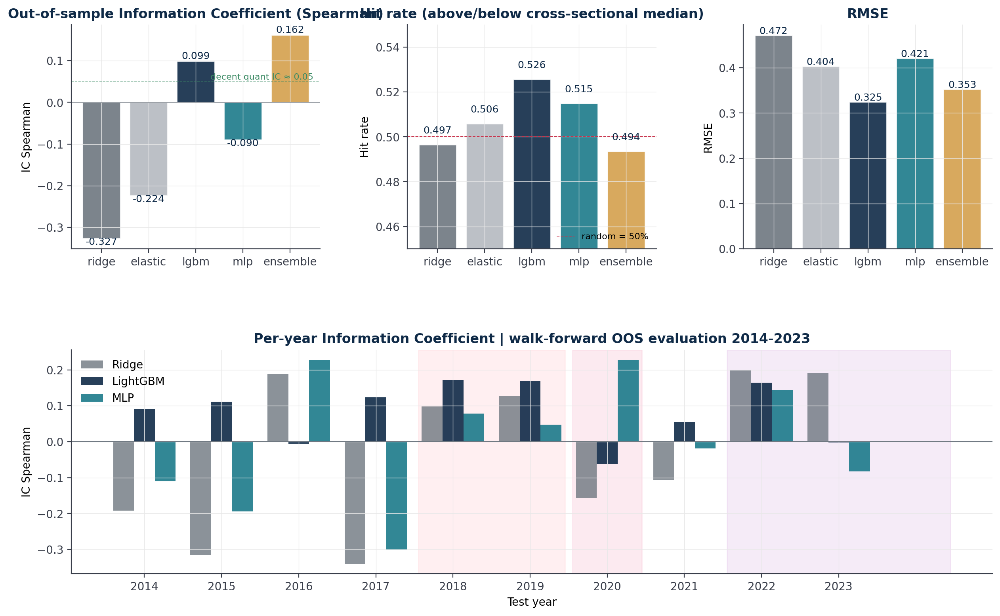
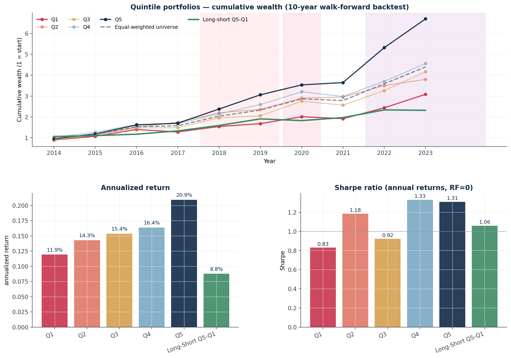

# US Industrials Cross-Sectional Return Forecasting

Quantitative ML pipeline for 1-year forward return prediction on the S&P 500 Industrials sector.

**Author**: Artemio Bresciani

**Universe**: 79 tickers, FY 2009-2023

---

## Headline results (walk-forward 2014-2023)

| Metric | Value |
|---|---:|
| LightGBM OOS IC Spearman | 0.099 |
| Cross-sectional hit rate | 52.6% |
| Q5 portfolio annualized return | 20.9% |
| Q5 Sharpe ratio | 1.31 |
| Long-Short Q5-Q1 annualized | 8.8% |
| Long-Short Sharpe | 1.06 |
| Long-Short hit rate | 80% (8/10 years) |
| Quintile monotonicity (Q1 → Q5) | 12% → 21% |

---

## Preview




---

## Project structure

```
quant_industrials/
├── src/                       # Pipeline modules (Python)
│   ├── 03_clean_panel.py      # Cleaning of raw exports
│   ├── 04_features.py         # Feature engineering (ratios, regimes, events)
│   ├── 05_model.py            # Walk-forward CV with 4 base models + ensemble
│   ├── 06_backtest.py         # Quintile portfolio backtest
│   ├── 07_interpret.py        # SHAP, permutation, partial dependence
│   ├── 08_robustness.py       # Seed/jackknife/regime/sector robustness
│   ├── 09_visualize.py        # 9 publication-grade figures
│   └── 10_advanced_viz.py     # UMAP + 3D regime + signal decomposition
├── data/
│   ├── raw/                   # Raw data exports (see data/raw/README.md)
│   └── processed/             # Cleaned panels, OOF predictions, metrics
├── figures/                   # 12 PNG figures (150 dpi)
├── notebooks/
│   └── a-bresciani_Industrials_ML_FULL.ipynb
└── reports/
    └── REPORT.md
```

---

## Quick start

```bash
git clone https://github.com/YOUR_USERNAME/quant-industrials-ml.git
cd quant-industrials-ml
python -m venv .venv
source .venv/bin/activate        # Windows: .venv\Scripts\activate
pip install -r requirements.txt
```

Then place the raw data files in `data/raw/` as described in [`data/raw/README.md`](data/raw/README.md), open the notebook and run all cells. Pipeline runs end-to-end in ~90 seconds on a 4-core CPU.

---

## Methodology summary

1. **Universe**: S&P 500 Industrials chain (`0#.SPLRCI`).
2. **Features** (45 numeric + 12 sub-industry one-hots):
   - Profitability ratios (gross/operating/net margin, EBITDA margin)
   - Returns on capital (ROA, ROE, ROIC proxy)
   - Leverage (D/E, D/A, D/EBIT)
   - Cash flow (OCF/Revenue, OCF/Assets)
   - Efficiency (asset turnover, R&D intensity, SG&A ratio, PP&E intensity)
   - Size (log Revenue, log Assets)
   - Growth YoY (revenue, op income, net income, assets)
   - Momentum (1Y, 6M, 3M past returns at fiscal year end)
   - Macro at fiscal year end (UST yields, term spread, VIX, DXY, SPX/XLI 12M return and vol)
   - 8 hardcoded geopolitical event dummies with intensity
3. **Models**: Ridge, ElasticNet, LightGBM, PyTorch MLP (2x[64->32], BatchNorm+GELU+Dropout 0.30), stacking ensemble.
4. **Validation**: Walk-forward expanding window, 10 OOS years (2014-2023).
5. **Backtest**: Annual quintile sort, equal-weighted, Long-Short Q5-Q1.

---

## Dependencies

```
numpy, pandas, scipy, scikit-learn
lightgbm
torch>=2.0
shap
umap-learn
matplotlib
plotly
```

Full pinned versions in `requirements.txt`. Install with:

```bash
pip install -r requirements.txt
```

---

## Limitations

1. Annual frequency, no transaction costs modeled (would deduct ~50-100 bps from Sharpe).
2. Possible factor overlap with standard momentum/size/quality factors.
3. Survivorship bias from using current S&P Industrials constituents (~1-3% annual upward bias).
4. Geopolitical event encoding is hardcoded ex-ante.
5. Sub-sector ablation suggests Aerospace & Defense should be modeled separately.

See `reports/REPORT.md` Section 8 for full discussion.

---

## Reproducibility

All code uses `SEED = 42` for numpy, torch, sklearn, and lightgbm. The pipeline can be run either via the notebook or sequentially through the scripts in `src/`:

```bash
python src/03_clean_panel.py
python src/04_features.py
python src/05_model.py
python src/06_backtest.py
python src/07_interpret.py
python src/08_robustness.py
python src/09_visualize.py
python src/10_advanced_viz.py
```

---

## License

MIT. See [LICENSE](LICENSE).
